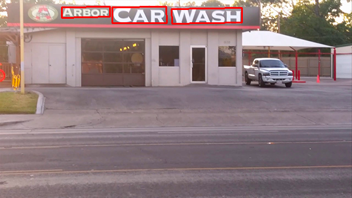
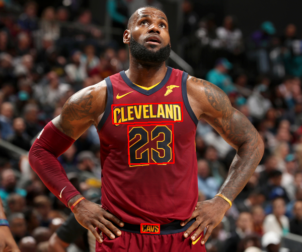
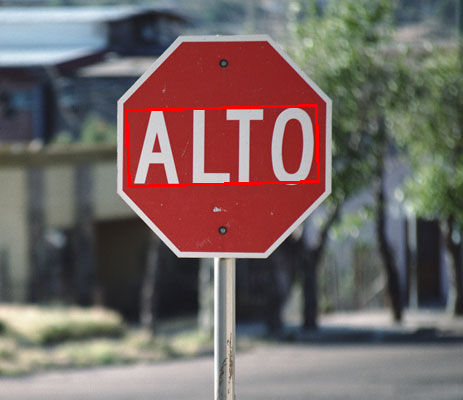

# opencv-east

# offical east
[url](https://github.com/argman/EAST)
# offical model(.pb)
[url](https://www.dropbox.com/s/r2ingd0l3zt8hxs/frozen_east_text_detection.tar.gz)

# export our ckpt model to pb
(1)change model.py
    images = mean_image_subtraction(images)
to 
    #images = mean_image_subtraction(images)
because opencv interface  cv2.dnn.blobFromImage can do this operation

(2)change model.py
    c1_1 = slim.conv2d(tf.concat([g[i-1], f[i]], axis=-1), num_outputs[i], 1)
to
    c1_1 = slim.conv2d(tf.concat([g[i-1], f[i]], axis=3), num_outputs[i], 1)
because opencv interface only support positive integer

(3)change model.py
    angle_map = (slim.conv2d(g[3], 1, 1, activation_fn=tf.nn.sigmoid, normalizer_fn=None) - 0.5) * np.pi/2 # angle is between [-45, 45]
    F_geometry = tf.concat([geo_map, angle_map], axis=-1)
to
    pi2 = 0.5 * np.pi
    angle_map = (slim.conv2d(g[3], 1, 1, activation_fn=tf.nn.sigmoid, normalizer_fn=None) - 0.5) * pi2 # angle is between [-45, 45]
    F_geometry = tf.concat([geo_map, angle_map], axis=3)
because div operation is not support in opencv，we change it to *0.5

(4)put the code after saver.restore
    output_graph = "frozen_model.pb"
    output_graph_def = tf.graph_util.convert_variables_to_constants(sess,tf.get_default_graph().as_graph_def(),["feature_fusion/Conv_7/Sigmoid", "feature_fusion/concat_3"])
    with tf.gfile.GFile(output_graph, "wb") as f:
        f.write(output_graph_def.SerializeToString())

after that you’ll get you own trained model and the pb suport opencv interface

# run
    python text_detection.py --image images/lebron_james.jpg --east frozen_east_text_detection.pb

